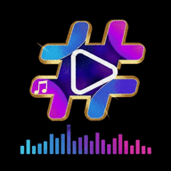

<div align="center">



# HashPlayer 2.8

**A private, offline-first audio & video player.**
Install it as an app on your phone or desktop, or build a real Android APK — same code, one repository.

`10-band EQ` · `visualizer` · `lyrics` · `subtitles` · `gestures` · `playlists` · `no account, no server, no tracking`

### [⬇️ Android APK download karein](https://github.com/mrghalibspcpu/HashPlayer/releases/latest)

`YouTube links` · `auto device scan` · `picture-in-picture` · `open with / share to` · `online lyrics` · `landscape video` · `home-screen widget`

</div>

---

## 🆕 Naya kya hai — 2.8

| Masla / feature | Ab kya hota hai |
|---|---|
| **Landscape me left side panel** | Video landscape me chalte waqt ab right palette ki tarah **left side par bhi ek panel** hai — **Enhancer · ANC · Skip silence · Pitch · YouTube 🔗**. Video par **tap** karte hi khulta hai aur **5 second baad khud chhup** jata hai (dobara tap = dobara 5 second). |
| **YouTube 🔗 left me shift** | YouTube link wala button right palette se nikal kar **left panel** me chala gaya — portrait me wapas apni purani jagah chala jata hai. |
| **Enhancer + ANC bottom se left panel me** | Landscape video me **Enhancer** aur **ANC** ab bottom bar ki jagah left panel me hain. Bottom bar sirf title, seek bar, times aur transport tak simat gaya — video ko zyada screen mili. |
| **Continue with Google** | Library ke upar ek card, aur **Settings → Google & YouTube** me button — dono **Continue with Google** wale: safed pill par rang-biranga G, tap karte hi Google ka apna account chooser app ke andar khulta hai. Screenshots wale sign-in screens jaisa hi, ek tap ka raasta. YouTube browser khulte waqt (signed out) card khud bhi aa jata hai; **Not now** dabane ke baad dobara tang nahi karta. |
| **Home-screen widget** | Chhota sa pyara widget: **search bar** (andar laal **▶ YouTube** icon — seedha YouTube khulta hai), **playlist** button, aur **last played file ka preview** (art + title + artist) play/pause ke saath. Tap = wahi file jahan chhodi thi wahin se chal parti hai. Lagane ka tareeqa: HashPlayer icon ko **long-press → Widgets → HashPlayer** ko home screen par kheench lein. |

---

## 🆕 Naya kya hai — 2.7

| Masla / feature | Ab kya hota hai |
|---|---|
| **Landscape three-dots menu** | Landscape video me teen dots ka menu (aur saare sheets/toasts) ab dikhte hain — ek CSS block band hona bhool gaya tha jis se landscape me context menu style hi nahi hota tha. |
| **Landscape video par blur tint** | Native video ab ambient aurora blobs / grain / scanlines ke neeche nahi dabti — landscape me video ke colors par jo blurry rang chadh jata tha, wo hat gaya. |
| **Har sound setting native par** | Pre-amp, Treble, Bass, Reverb, Volume boost aur EQ ab Android (ExoPlayer) engine par bhi asli device effects se lagte hain — LoudnessEnhancer, PresetReverb, BassBoost aur 10-band EQ. |
| **ANC button** | Bottom panel me naya **ANC** button (audio + video dono): rumble/hiss cut, mud kam, vocals aur dialogue clear aur boosted — web par Web Audio chain, Android par vocal-focused EQ + loudness. |
| **Video Enhancer** | Bottom panel me naya **Enhance** button (sirf video): pro colour grade — vibrant colors, darker blacks, behtar sharpness, bina over-saturation ke. WebView video par CSS grade, native video par TextureView colour matrix. |
| **Add to playlist — har jagah** | Library cards ke ilawa ab queue aur playlist detail ki har file par long-tap se poora menu khulta hai, jis me **Add to playlist** bhi hai. |
| **Side panel spacing** | Video side control panel ke icons ki spacing thodi kam kar di gayi. Lyrics ab album art ke andar hi rehte hain, stage par nahi phailte. |
| **YouTube bar neeche** | In-app YouTube browser ki bar (close, Sign in with Google pill, Play in HashPlayer) ab top ki jagah **bottom** par hai — thumb ki pahunch me. |

---

## 🆕 Naya kya hai — 2.6

| Masla / feature | Ab kya hota hai |
|---|---|
| **Sign in with Google** | YouTube browser ki bar me ab doosri apps jaisa safed **“G Sign in with Google”** pill hai — tap karein aur Google ka apna account chooser usi WebView me khulta hai, ek baar sign in, cookies yaad. Sign in hone par pill **“✓ Signed in”** ban jata hai; **long-press** karein to sign out. |
| **Search ka shortcut** | Library ki search bar ab phir se **YouTube ke results neeche hi dikhati hai** (“From YouTube” section) — bina browser khole seedha tap kar ke play. Poora YouTube chahiye to wahi laal icon maujood hai. Settings → Playback me ye inline results band bhi kiye ja sakte hain. |
| **Pitch** | Bottom control panel me naya **Pitch** button (sirf portrait me, audio aur video dono ke liye): −12 se +12 semitone. Ye ExoPlayer ke sonic stretcher se chalta hai — **Pitch se raftar nahi badalti aur Speed se pitch nahi badalti**, dono bilkul alag knobs hain. |

---

## 🆕 Naya kya hai — 2.5

| Masla / feature | Ab kya hota hai |
|---|---|
| **YouTube sign in** | In-app YouTube browser ki upar wali bar me **Sign in** button. Ek baar Google se sign in karein — cookies mehfooz rehti hain, is liye agli dafa aapka apna home feed, subscriptions, history aur suggestions aate hain, bilkul YouTube app ki tarah. (WebView ko asli Chrome user-agent diya gaya hai, warna Google sign-in block kar deta hai.) |
| **Har site ki video** | TikTok, Facebook, Instagram, X, Dailymotion, Vimeo, Reddit ya koi bhi page — link share karein, "Open with" me HashPlayer chunein, ya URL sheet me paste karein. Page app ke andar khulta hai, HashPlayer uski asli video file khud dhoond leta hai aur **▶ Play in HashPlayer** button laal ho jata hai — tap karein aur video page ke apne cookies/referer ke saath hamare engine me chalti hai. |
| **Offline download** | YouTube video chalte waqt side panel me naya **save** button. Tap karein — video seedha phone ke `Movies/HashPlayer` folder me save hoti hai (progress % button par), aur khatam hote hi library me aa jati hai, bina internet ke chalne ke liye. (Ek hi file wali progressive stream save hoti hai, kyunki app me transcoder nahi hai.) |

---

## 🆕 Naya kya hai — 2.4

| Masla / feature | Ab kya hota hai |
|---|---|
| **YouTube search ke results app jaisay nahi thay** | App ke andar ki “From YouTube” list hata di gayi. Ab search bar me **YouTube ka icon** hai — tap karte hi **asli youtube.com app ke andar hi khul jata hai**: wahi home feed, wahi suggestions, wahi search aur bilkul wahi tarteeb jo YouTube app me hoti hai. Kisi bhi video par tap karein — page me chalne ke bajaye wo **HashPlayer me** chalti hai, apne gestures, speed, PiP aur queue ke saath. |
| **Zoom** | Pinch se **1× se 8×** tak zoom, zoom ke baad ungli se pan/drag, screen par live “2.4×” badge. Android par native ExoPlayer picture par bhi chalta hai aur rotate/mirror ke saath tootta nahi. |
| **Landscape me caption button** | Landscape me neeche ke control panel se **Captions** button bhi chhup jata hai (Skip Silence ki tarah) — video ke side palette wala CC waise hi maujood hai. |

---

## 🆕 Naya kya hai — 2.3

| Masla / feature | Ab kya hota hai |
|---|---|
| **Volume slider aur swipe se awaaz nahi badalti thi** | Slider aur dayein side ki vertical swipe ab **device ki asli media volume** chalate hain — bilkul waise hi jaise volume buttons. Hardware buttons dabayein to app ka slider bhi saath chalta hai, aur swipe device ke apne steps par snap hoti hai. (Pehle ye sirf Web Audio gain hilati thi, jis se ExoPlayer aur YouTube ki awaaz guzarti hi nahi.) |
| **YouTube par app ke controls nahi thay** | Android par YouTube ab **HashPlayer ke apne engine (ExoPlayer) me** chalti hai: wahi seek bar, gestures, speed, sleep timer, queue, PiP aur lock-screen notification jo local video ke liye hain. Agar koi video natively na khule to app chupke se purane IFrame embed par chali jaati hai — video har haal me chalti hai. |
| **Speed aur Lock buttons** | Video ke side panel me do naye buttons: **Playback speed** (0.25× – 3×, button par chhota badge) aur **Screen lock** — lock karte hi poori screen ki touch band, taake jeb me ya ungli lagne se video na ruke. Unlock: tap → *Tap to unlock* (desktop par `U` ya `Esc`, phone par back button). |
| **Search sirf apni library me thi** | Ab wahi search bar **YouTube bhi search karta hai** (internet ho to). Apni library ke neeche alag “From YouTube” section aata hai — tap karein aur video seedha app ke player me chal padti hai. Settings → Playback me band bhi kar sakte hain. |

---

## 🆕 Naya kya hai — 2.1

| Masla / feature | Ab kya hota hai |
|---|---|
| **YouTube link** | URL sheet me YouTube link paste karein, ya YouTube app me **Share → HashPlayer** — video HashPlayer ke apne controls, gestures, sleep timer aur queue ke saath chalti hai. (YouTube apni audio khud deta hai, is liye us par EQ/visualizer kaam nahi karte — app aapko saaf bata deti hai.) |
| **Device scan khud nahi hota tha** | App khulte hi ek baar permission maang kar poori device ki audio+video khud scan kar leti hai. Settings me band bhi kar sakte hain. |
| **Atak atak ke chalna** | **Smooth mode** — phone par by default on. Bhaari blur/glow layers hat jaati hain, visualiser 30fps par cap, seek-bar updates throttle, aur Android side par file seeking ab direct byte offset se hoti hai (pehle poori file padhni padti thi). |
| **Landscape me view kharab** | Phone landscape me video poori screen leti hai aur controls uske upar float karte hain; tap karne par chhup/dikh jaate hain. Rotate karte hi apne aap full-screen. |
| **PiP nahi chalta tha** | Ab asli Android picture-in-picture. Home dabayein to video khud floating window me chali jaati hai. |
| **File manager me "Open with"** | Har audio/video file par HashPlayer option aata hai — multi-file share bhi chalta hai. |
| **Lyrics** | Lyrics sheet me **Find online** — ek tap me synced `.lrc` aa jaate hain (LRCLIB, bina account ke). |

---

## 🚀 Jaldi se shuru karein (quick start)

| Aap kya chahte hain | Kya karein |
|---|---|
| **Android phone pe install** | [Latest release](https://github.com/mrghalibspcpu/HashPlayer/releases/latest) se `-release.apk` download karein → tap karein → **Install** |
| **Phone/PC pe app ki tarah install** | `web/` folder ko kisi bhi hosting (GitHub Pages) pe daalein → browser me kholein → **Install app** button dabayein |
| **Android APK (.apk file)** | GitHub → **Actions** → **Build HashPlayer APK** → **Run workflow** → run khatam hone par **Artifacts** se APK download karein |
| **Sirf test karna hai** | `cd web && python3 -m http.server 8080` → `http://localhost:8080` |

> Aapki files kabhi upload nahi hoti. Sab kuch aapke device par hi rehta hai.

---

## ✨ What's inside

### Library
- Add **files, whole folders, drag & drop, or a direct URL** — audio *and* video
- **Reads tags locally**: ID3v1, ID3v2.2/2.3/2.4, MP4/M4A, FLAC, OGG/Opus, WAV → title, artist, album, genre, year, track no.
- **Album art** extracted from the file and used as cover, blurred backdrop and UI accent colour
- Saved in **IndexedDB**, so your library is still there the next time you open the app
- Search, sort (added / title / artist / album / length / plays / size), grid or list, favourites, recently played, most played
- Playlists, queue with **drag-to-reorder**, play-next, smart (weighted) shuffle, repeat one/all
- Import & export your library as JSON

### Sound
- **10-band equaliser** (31 Hz → 16 kHz) with 14 presets + live response curve
- Pre-amp, bass boost, treble, **reverb**, **stereo width**, balance, mono downmix
- **Night mode** compressor, **volume boost to 300 %**, fade on play/pause, **crossfade up to 12 s**
- Playback speed 0.25× – 3× with pitch preservation, A–B loop, bookmarks
- Five visualizers: bars, mirror, wave, radial, nebula

### Video
- Swipe gestures: **left/right = seek, left half = brightness, right half = volume**, double-tap = ±10 s, long-press = fast-forward, pinch = zoom
- Picture-in-picture, fullscreen, rotate, mirror, fit/cover/fill, **frame screenshots**
- **Playback speed** and **screen lock** right in the side panel — the lock swallows every touch until you tap *unlock*
- **Subtitles**: `.srt`, `.vtt` and `.ass` (converted on the fly), toggle with one tap

### Home-screen widget
- A small 3 × 2 widget: **search bar** (tap → the app opens with search focused, YouTube results included), the red **▶** inside it (straight into YouTube), a **playlist** shortcut
- and the **file you played last** — art, title, artist — with a play/pause button that resumes it from where it stopped
- The thumbnail is read natively (MediaStore / embedded cover / a video frame / a YouTube thumbnail), and play-pause never drags the app to the front

### YouTube (Android)
- Paste a link, share from the YouTube app, or just **search** — the same library search box also lists YouTube results when you are online
- Videos play **inside HashPlayer's own engine**, so every control, gesture and side tool works exactly like a local file
- Streams are resolved through YouTube's own API on the device; nothing is downloaded, no account, no key, no third-party server
- If a video refuses to stream (age gate, region block), the player silently falls back to the embedded YouTube frame

### Words
- **Lyrics**: embedded (USLT/SYLT) or `.lrc` files — synced, karaoke-style, tap a line to jump, offset adjust
- Sidecar files are matched automatically: `song.mp3` + `song.lrc` + `song.srt`

### The app itself
- Installable **PWA** with an offline service worker — works with no internet at all
- 5 colour themes × dark / AMOLED / light, album-art tinting, **Simple mode** (clean) vs **Pro mode** (everything)
- **English + اردو** (full RTL layout)
- Media-session integration: lock-screen controls, headset buttons, Android notification
- Sleep timer with fade-out, resume where you left off, keyboard shortcuts for everything
- An "energy timeline" painted into the seek bar as you listen — a fingerprint of the track

---

## 📱 Build the Android APK

The Android app is a thin native shell around the exact same web app, so there is only one copy of the player code.
It adds what a browser cannot do on Android:

- **MediaStore scan** — finds every song and video on the phone
- Streams those `content://` files to the player **with HTTP Range support** (so seeking works)
- A real system **file picker** for `<input type="file">`
- **Background playback** + media notification with lock-screen controls (foreground service + `MediaSession`)
- Hardware **back button** handling and "Open with HashPlayer" from any file manager

### Build it in the cloud (no tools needed)
1. Open the repository on GitHub → **Actions**
2. Pick **Build HashPlayer APK** → **Run workflow**
3. Wait ~4 minutes → open the finished run → **Artifacts** → `HashPlayer-apk`
4. Unzip, copy the `.apk` to your phone, tap it, allow "install from unknown sources"

### Build it locally
```bash
# needs JDK 17 and the Android SDK (Android Studio installs both)
gradle assembleDebug          # or: ./gradlew assembleDebug if you generate a wrapper
# → app/build/outputs/apk/debug/app-debug.apk
```
Opening the folder in **Android Studio** also works — press ▶.

---

## 🌍 Publish the web player

Push to `main` with GitHub Pages enabled (Settings → Pages → *GitHub Actions*) and the
`Deploy web player to GitHub Pages` workflow publishes the `web/` folder.
Then open the URL on your phone → browser menu → **Add to Home screen**.

---

## 🗂 Repository layout

```
web/                     the player (this is the product)
 ├─ index.html           shell + inline SVG icon sprite
 ├─ css/                 base.css (tokens/themes) · app.css (shell) · player.css (now playing)
 ├─ js/
 │   ├─ util.js          helpers, settings store, i18n, colour extraction
 │   ├─ db.js            IndexedDB wrapper (tracks / playlists / key-value)
 │   ├─ meta.js          tag reader, LRC parser, SRT→VTT converter
 │   ├─ engine.js        Web Audio graph (EQ, effects, analyser)
 │   ├─ visual.js        visualizers + energy timeline
 │   ├─ yt.js            YouTube parsing, online search, IFrame fallback player
 │   ├─ native.js        bridge to the Android engine (ExoPlayer, device volume)
 │   ├─ library.js       import pipeline, storage, grid + YouTube result rendering
 │   ├─ player.js        playback, queue, gestures, lyrics, media session
 │   └─ app.js           shell wiring, settings, shortcuts, PWA, Android bridge
 ├─ manifest.webmanifest · sw.js · icons/
app/                     Android shell (Kotlin) — WebView + MediaStore + media notification
 ├─ MainActivity.kt      WebView host, in-app browser, "Continue with Google" card, widget intents
 ├─ NativePlayback.kt    ExoPlayer engine (mkv/avi/hevc, EQ, ANC, enhancer, pitch, silence skip)
 ├─ HashWidget.kt        the home-screen widget + the store it reads its last-played art from
 └─ GoogleSignIn.kt      the Google sign-in card (built in code, like the rest of the shell)
 └─ src/main/java/.../YouTubeStream.kt   resolves YouTube streams for the native engine
.github/workflows/       APK build + Pages deploy
legacy/                  the original single-file v1 player, kept for reference
```

No build step, no bundler, no npm, no CDN — every byte is served from your own origin,
which is also why it works completely offline and inside the APK.

---

## ⌨️ Shortcuts (desktop)

`Space`/`K` play · `←/→` seek · `Shift+←/→` 1 min · `↑/↓` volume · `M` mute · `N/B` next/prev
`F` fullscreen · `P` picture-in-picture · `S` shuffle · `R` repeat · `E` Sound Lab · `Q` queue
`Y` lyrics · `C` subtitles · `V` visualizer · `A` A–B loop · `D` bookmark · `[ ]` speed · `/` search
`U` lock / unlock the video screen

---

## 🔒 Privacy

There is no server. No analytics, no accounts, no network calls except the ones you make
yourself by adding a URL or searching YouTube (that request goes straight to YouTube,
with no key and no account, and only while you are typing in the search box). Tags, album art, playlists and settings live in your browser's
IndexedDB / localStorage on your own device and are deleted when you clear the app's data.

---

<div align="center">Built by <b>HASH TECH</b> · MIT-friendly, do what you like with it.</div>
